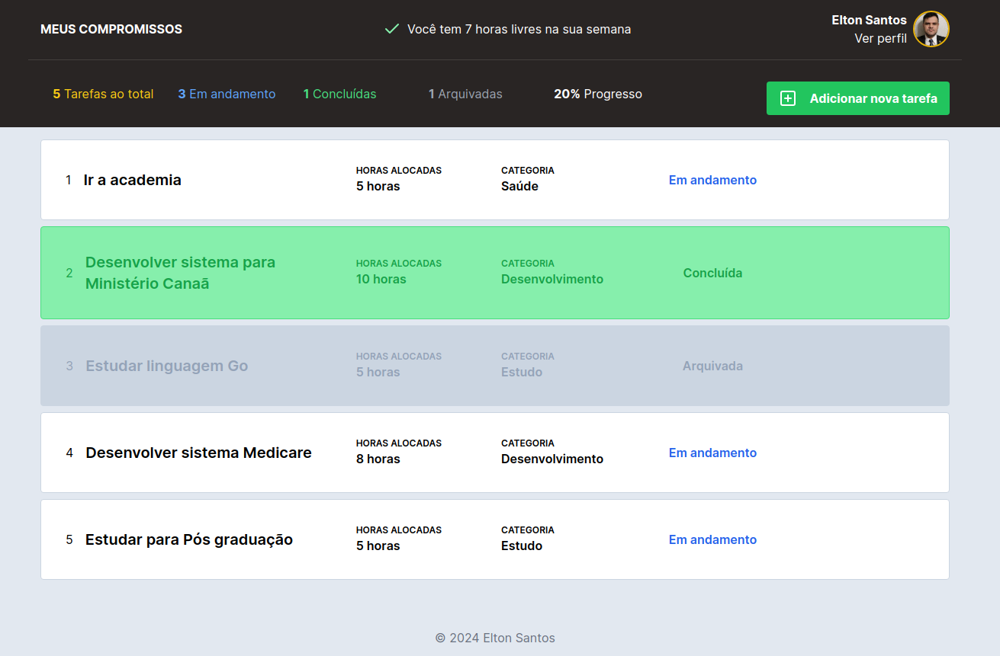
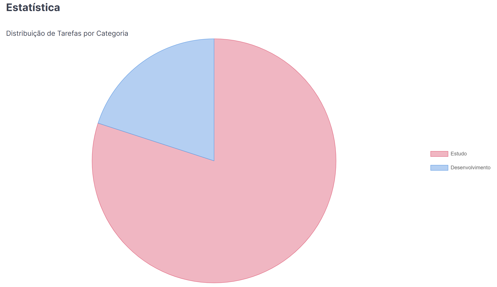
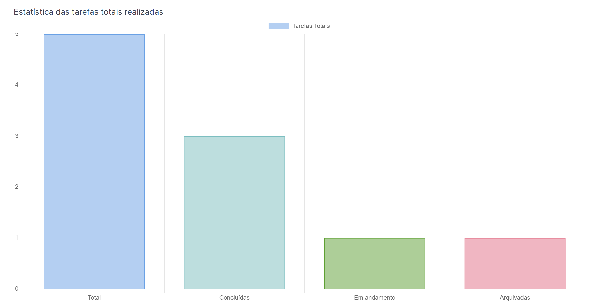
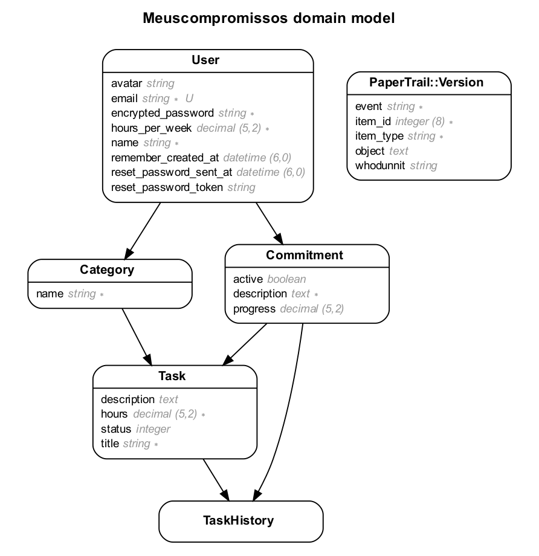

<p align="center">
  <a href="#-technologies">Technologies</a>&nbsp;&nbsp;&nbsp;|&nbsp;&nbsp;&nbsp;
  <a href="#-getting-started">Getting started</a>&nbsp;&nbsp;&nbsp;|&nbsp;&nbsp;&nbsp;
  <a href="#-project">Project</a>&nbsp;&nbsp;&nbsp;|&nbsp;&nbsp;&nbsp;
  <a href="#-layout">Layout</a>&nbsp;&nbsp;&nbsp;|&nbsp;&nbsp;&nbsp;
  <a href="#-entity-relationship-diagram-erd">ERD</a>&nbsp;&nbsp;&nbsp;|&nbsp;&nbsp;&nbsp;
  <a href="#-next-steps">Next steps</a>
</p>

<h1 align="center">
  <a href="#" target="_blank">
    MEUS COMPROMISSOS
  </a>
</h1>

---

## 🧪 Technologies and Gems

This project was developed using the following technologies and Gems:

- [Ruby 3.3.4](https://ruby-lang.org/)
- [Rails 7.2.1](https://rubyonrails.org/)
- [Postgres](https://postgresql.org/)
- [Tailwind](https://tailwindcss.com/)
- [Stimulus](https://stimulus.hotwired.dev)
- [Rails Toastify](https://github.com/eltonsantos/rails_toastify)
- [Devise](https://github.com/heartcombo/devise)
- [Kaminari](https://github.com/kaminari/kaminari)
- [Lucide Icons](https://lucide.dev/)
- [Paper Trail](https://github.com/paper-trail-gem/paper_trail)
- [Rails ERD](https://github.com/voormedia/rails-erd)
- [Bullet](https://github.com/flyerhzm/bullet)

## 🚀 Getting started

Clone the project and access the folder

```bash
$ git clone https://github.com/eltonsantos/meuscompromissos.git && cd meuscompromissos
```

Follow the steps below

```bash
# Install the dependencies
$ bundle install

# Create database
$ rails db:create

# Run migrations
$ rails db:migrate

# Run seed
$ rails db:seed

# Start the project
$ bin/dev
```

## 💻 Project

The "Meus Compromissos" system is a practical tool for managing weekly tasks and commitments, allowing you to organize your week efficiently. With features such as task creation, progress tracking, and commitment management, the system makes it easy to visualize and prioritize activities, ensuring you're always in control of your weekly responsibilities.

## 🔖 Layout

<p align="center">
  
</p>

<p align="center">
  
</p>

<p align="center">
  
</p>

## 🔖 Entity Relationship Diagram (ERD)

* Still in development

<p align="center">
  
</p>

## 🐾 Next steps

###### Escreverei essa parte em português

- [ ] Cobrir o sistema de testes! 👁‍🗨
- [ ] Refatorar código! 👁‍🗨
- [ ] Alterar visual em dark/light mode 🌗
- [ ] Layout responsivo 1️⃣
- [ ] Criar paginação 🥖
- [ ] E muito mais... ❤💪🏼

---

## 👨🏻‍💻 Author

<h3 align="center">
  
  <br/>
  <strong>Elton Santos</strong> 🚀
  <br/>
  <br/>

 <a href="https://www.linkedin.com/in/eltonmelosantos" alt="LinkedIn" target="blank">
    
  </a>

  <a href="mailto:elton.melo.santos@gmail.com?subject=Olá%20Elton" alt="Email" target="blank">
    
  </a>

<br/>

Made with ❤️ by Elton Santos 👋🏽 [Contact me!](https://www.linkedin.com/in/eltonmelosantos/)

</h3>
